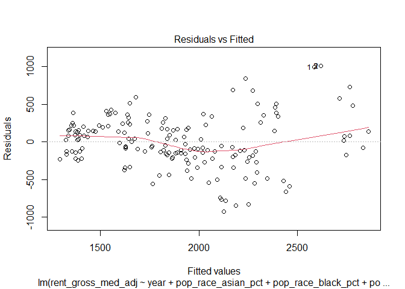
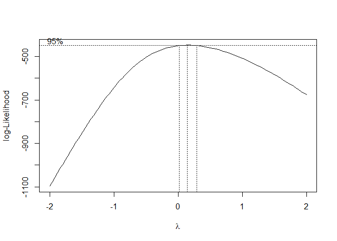
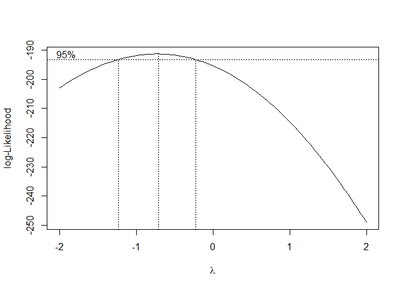
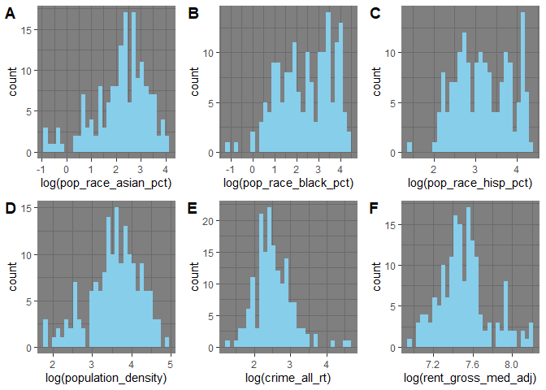
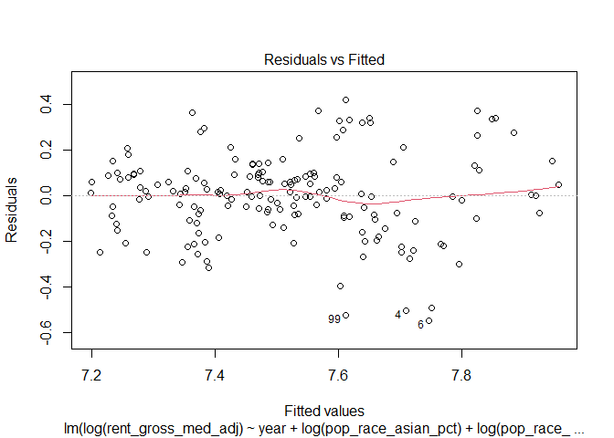

**This project focuses on the housing affordability throughout the
boroughs of New York City, analyzed through the lens of median rent
prices and how neighborhood characteristics predict higher rents.**

First, load in libraries.

``` r
library(dplyr)
```

    ## 
    ## Attaching package: 'dplyr'

    ## The following objects are masked from 'package:stats':
    ## 
    ##     filter, lag

    ## The following objects are masked from 'package:base':
    ## 
    ##     intersect, setdiff, setequal, union

``` r
library(ggplot2)
library(tidyr)
library(car)
```

    ## Loading required package: carData

    ## 
    ## Attaching package: 'car'

    ## The following object is masked from 'package:dplyr':
    ## 
    ##     recode

``` r
library(corrplot)
```

    ## corrplot 0.95 loaded

``` r
library(arm)
```

    ## Loading required package: MASS

    ## 
    ## Attaching package: 'MASS'

    ## The following object is masked from 'package:dplyr':
    ## 
    ##     select

    ## Loading required package: Matrix

    ## 
    ## Attaching package: 'Matrix'

    ## The following objects are masked from 'package:tidyr':
    ## 
    ##     expand, pack, unpack

    ## Loading required package: lme4

    ## 
    ## arm (Version 1.14-4, built: 2024-4-1)

    ## Working directory is C:/Users/withe/OneDrive/Desktop/DIDA 380D/tutorials

    ## 
    ## Attaching package: 'arm'

    ## The following object is masked from 'package:corrplot':
    ## 
    ##     corrplot

    ## The following object is masked from 'package:car':
    ## 
    ##     logit

``` r
library(cowplot)
```

Set working directory, load in the data, and view it.

``` r
setwd("C:/Users/withe/OneDrive/Desktop/DIDA 380D/data")
data <- read.csv("coredata.csv")
head(data)
```

    ##   region_id region_display   region_name region_type year adlt_incar_rt
    ## 1       606            NYC New York City        City 2000      1,340.70
    ## 2       606            NYC New York City        City 2001              
    ## 3       606            NYC New York City        City 2002              
    ## 4       606            NYC New York City        City 2003              
    ## 5       606            NYC New York City        City 2004              
    ## 6       606            NYC New York City        City 2005      1,048.20
    ##   afford_le030_rct afford_le080_rct afford_le120_rct crime_all_rt crime_prop_rt
    ## 1                                                            23.1          15.4
    ## 2                                                            20.3          13.6
    ## 3                                                            19.3          12.9
    ## 4                                                            18.4          12.4
    ## 5                                                            17.7          12.1
    ## 6             5.2%            43.1%            76.3%         16.9          11.3
    ##   crime_viol_rt gross_rent_0_1beds gross_rent_2_3beds hh_alone_pct
    ## 1           7.6                                                   
    ## 2           6.8                                                   
    ## 3           6.4                                                   
    ## 4           6.0                                                   
    ## 5           5.7                                                   
    ## 6           5.6                                              33.1%
    ##   hh_inc_med_adj hh_inc_own_med_adj hh_inc_rent_med_adj hh_u18_pct
    ## 1        $72,300                                             34.0%
    ## 2                                                                 
    ## 3                                                                 
    ## 4                                                                 
    ## 5                                                                 
    ## 6        $53,780            $87,930             $41,010      32.7%
    ##   hp_first_fhava_pct hp_first_hi_pct hp_first_orig hp_first_orig_lmi_app_pct
    ## 1                                                                           
    ## 2                                                                           
    ## 3                                                                           
    ## 4                                                                           
    ## 5               2.2%            8.4%         59659                      7.2%
    ## 6               0.6%           20.1%        59,169                      5.8%
    ##   hp_first_orig_lmi_nbhd_pct hp_first_orig_rt hpi_1f hpi_4f hpi_al hpi_cn
    ## 1                                          NA     NA     NA     NA     NA
    ## 2                                          NA     NA     NA     NA     NA
    ## 3                                          NA     NA     NA     NA     NA
    ## 4                                          NA     NA     NA     NA     NA
    ## 5                      23.9%             48.1     NA     NA     NA     NA
    ## 6                      25.5%             46.8     NA     NA     NA     NA
    ##   hpi_ot income_diversity_ratio lp_all lp_fam14condo_initial lp_fam14condo_rate
    ## 1     NA                     NA  7,351                 5,168                9.0
    ## 2     NA                     NA  7,308                 5,185                9.0
    ## 3     NA                     NA  7,993                 5,701               10.0
    ## 4     NA                     NA  7,645                 5,287                9.4
    ## 5     NA                     NA  6,951                 4,885                8.4
    ## 6     NA                    6.1  6,885                 5,023                8.3
    ##   lp_fam14condo_repeat med_r_1f med_r_4f med_r_cn med_r_ot nb_permit_res_units
    ## 1                1,315 $402,880 $225,860 $492,080  $79,360              15,544
    ## 2                1,379 $437,630 $243,820 $525,270  $86,340              15,744
    ## 3                1,613 $470,230 $257,750 $574,720  $94,920              18,879
    ## 4                1,697 $541,530 $304,040 $623,640 $113,210              20,050
    ## 5                1,544 $603,800 $342,690 $775,140 $130,720                   9
    ## 6                1,400 $667,790 $380,330 $824,920 $152,220                  97
    ##   pct_prof_ela pct_prof_math pfn_fam14condo pfn_fam14condo_rate pop_65p_pct
    ## 1                                                            NA       11.7%
    ## 2                                                            NA            
    ## 3                                                            NA            
    ## 4                                                            NA            
    ## 5                                                            NA            
    ## 6                                                            NA       11.9%
    ##   pop_bornstate_pct pop_commute_carfree_pct pop_commute_time_avg
    ## 1                                     63.8%                 40.0
    ## 2                                                             NA
    ## 3                                                             NA
    ## 4                                                             NA
    ## 5                                                             NA
    ## 6             49.5%                   67.0%                 39.1
    ##   pop_disabled_pct pop_discon_youth_pct pop_edu_collp_pct pop_edu_nohs_pct
    ## 1                                                   27.4%                 
    ## 2                                                                         
    ## 3                                                                         
    ## 4                                                                         
    ## 5                                                                         
    ## 6                                                   32.2%            21.0%
    ##   pop_foreign_pct   pop_num pop_pov_65p_pct pop_pov_pct pop_pov_u18_pct
    ## 1           35.9% 8,008,278                       21.2%                
    ## 2                                                                      
    ## 3                                                                      
    ## 4                                                                      
    ## 5                                                                      
    ## 6           36.6% 7,956,113           20.3%       19.1%           27.7%
    ##   pop_race_asian_pct pop_race_black_pct pop_race_div_idx pop_race_hisp_pct
    ## 1               9.7%              24.5%             0.74             27.0%
    ## 2                                                     NA                  
    ## 3                                                     NA                  
    ## 4                                                     NA                  
    ## 5                                                     NA                  
    ## 6              11.5%              23.8%             0.73             27.9%
    ##   pop_race_white_pct pop16_laborforce_pct pop16_unemp_pct population_density
    ## 1              35.0%                                9.57%                 NA
    ## 2                                                                         NA
    ## 3                                                                         NA
    ## 4                                                                         NA
    ## 5                                                                         NA
    ## 6              34.5%                62.0%           8.42%                 NA
    ##   priv_evic_amt_sought_med_adj priv_evic_filing_rt priv_evic_filings
    ## 1                                               NA                  
    ## 2                                               NA                  
    ## 3                                               NA                  
    ## 4                                               NA                  
    ## 5                                               NA                  
    ## 6                                               NA                  
    ##   prox_park_pct prox_subway_pct rburden_mod_ami_81_120 rburden_mod_ami_le80
    ## 1                                                                          
    ## 2                                                                          
    ## 3                                                                          
    ## 4                                                                          
    ## 5                                                                          
    ## 6                                                21.6%                31.1%
    ##   rburden_sev_ami_81_120 rburden_sev_ami_le80 refi_hi_pct refi_orig
    ## 1                                                                  
    ## 2                                                                  
    ## 3                                                                  
    ## 4                                                                  
    ## 5                                                   15.4%     63811
    ## 6                   3.2%                45.6%       29.9%    59,603
    ##   refi_orig_rt rent_burden_med rent_burden_mod_pct rent_burden_sev_pct
    ## 1           NA           26.2%                                   23.7%
    ## 2           NA                                                        
    ## 3           NA                                                        
    ## 4           NA                                                        
    ## 5         51.4                                                        
    ## 6         47.2           31.0%               23.8%               27.9%
    ##   rent_change rent_gross_med_adj rent_gross_recent_med_adj rent_pct_nycha reo
    ## 1                         $1,290                                          987
    ## 2                                                                         966
    ## 3                                                                         695
    ## 4                                                                         580
    ## 5                                                                         338
    ## 6                         $1,430                    $1,810                189
    ##   serious_viol_rate shd_420c_props shd_420c_units shd_421a_props shd_421a_units
    ## 1                NA             NA             NA             NA             NA
    ## 2                NA             NA             NA             NA             NA
    ## 3                NA             NA             NA             NA             NA
    ## 4                NA             NA             NA             NA             NA
    ## 5              47.7             NA             NA             NA             NA
    ## 6              63.1             NA             NA             NA             NA
    ##   shd_all_sub_props shd_all_sub_units shd_ex_2025_2030_props
    ## 1                NA                                       NA
    ## 2                NA                                       NA
    ## 3                NA                                       NA
    ## 4                NA                                       NA
    ## 5                NA                                       NA
    ## 6                NA                                       NA
    ##   shd_ex_2025_2030_units shd_ex_2031_2040_props shd_ex_2031_2040_units
    ## 1                     NA                     NA                       
    ## 2                     NA                     NA                       
    ## 3                     NA                     NA                       
    ## 4                     NA                     NA                       
    ## 5                     NA                     NA                       
    ## 6                     NA                     NA                       
    ##   shd_ex_2041_later_props shd_ex_2041_later_units shd_hud_finins_props
    ## 1                      NA                      NA                   NA
    ## 2                      NA                      NA                   NA
    ## 3                      NA                      NA                   NA
    ## 4                      NA                      NA                   NA
    ## 5                      NA                      NA                   NA
    ## 6                      NA                      NA                   NA
    ##   shd_hud_finins_units shd_hud_pbrap_props shd_hud_pbrap_units shd_lihtc_props
    ## 1                   NA                  NA                  NA              NA
    ## 2                   NA                  NA                  NA              NA
    ## 3                   NA                  NA                  NA              NA
    ## 4                   NA                  NA                  NA              NA
    ## 5                   NA                  NA                  NA              NA
    ## 6                   NA                  NA                  NA              NA
    ##   shd_lihtc_units shd_ml_props shd_ml_units shd_nyc_prog_props shd_ph_props
    ## 1              NA           NA                              NA           NA
    ## 2              NA           NA                              NA           NA
    ## 3              NA           NA                              NA           NA
    ## 4              NA           NA                              NA           NA
    ## 5              NA           NA                              NA           NA
    ## 6              NA           NA                              NA           NA
    ##   shd_ph_units total_viol_rate unit_le50_tar unit_le50_tar_per_capita unit_num
    ## 1           NA              NA                                                
    ## 2           NA              NA                                                
    ## 3           NA              NA                                                
    ## 4           NA              NA                                                
    ## 5           NA           212.4                                                
    ## 6           NA           313.7                                         3275412
    ##   unit_occ_own_pct unit_occ_rent_sevcrowd_pct unit_vac_rent_pct units_cert
    ## 1            30.2%                                                  13,603
    ## 2                                                                   14,289
    ## 3                                                                   15,024
    ## 4                                                                   17,192
    ## 5                                                                   19,052
    ## 6            33.1%                                         3.7%     19,688
    ##   volume_1f volume_4f volume_al volume_cn volume_ot voucher_pct
    ## 1    13,586    13,702    33,454      4842      1324            
    ## 2    13,753    14,165    34,578      5284      1376            
    ## 3    16,933    17,581    44,954      8431      2009            
    ## 4    15,893    16,812    44,992     10421      1866            
    ## 5    16,641    17,442    46,592     10649      1860            
    ## 6    17,134    19,451    50,977     11973      2419

Here, I select the variables of interest. The dependent variable is the
median gross rent, and its predictors are: year, percent of total Asian,
black, Hispanic, and white populations, the population density, and the
amount of all major felonies committed in an area per 1,000 residents.

I load it into data_clean, filtering for the years 2021-2023. I also
delete City and Boroughs, since they’re too broad, leaving only
Sub-Boroughs and Community Districts. In this data set, these two are
pretty much the same, just different methods through which governing
bodies split up the NYC region. Later, they’ll all be consolidated into
one entry. For now, there are many duplicates which have the same region
IDs. In order to better figure out how to analyze them, I select for
region_id, region_name, and region_type. Region_display will be used
later on to create a borough field.

``` r
data_clean <- data %>% dplyr::select(region_id, region_display, region_name, 
                                     region_type, year, rent_gross_med_adj,
                                     pop_race_asian_pct,pop_race_black_pct,
                                     pop_race_hisp_pct, pop_race_white_pct,
                                     population_density, crime_all_rt) %>%
  filter(year == "2023" | year == "2022" | year == "2021") %>%
  filter(region_type != "City" & region_type != "Borough") %>%
  arrange(region_id)
head(data_clean)
```

    ##   region_id region_display                          region_name
    ## 1       101          MN 01 Greenwich Village/Financial District
    ## 2       101          MN 01 Greenwich Village/Financial District
    ## 3       101          MN 01 Greenwich Village/Financial District
    ## 4       101          MN 01                   Financial District
    ## 5       101          MN 01                   Financial District
    ## 6       101          MN 01                   Financial District
    ##          region_type year rent_gross_med_adj pop_race_asian_pct
    ## 1   Sub-Borough Area 2021             $3,580              16.6%
    ## 2   Sub-Borough Area 2022             $3,630              16.1%
    ## 3   Sub-Borough Area 2023             $3,630              15.8%
    ## 4 Community District 2021                                      
    ## 5 Community District 2022                                      
    ## 6 Community District 2023                                      
    ##   pop_race_black_pct pop_race_hisp_pct pop_race_white_pct population_density
    ## 1               4.6%              8.4%              66.4%               50.8
    ## 2               3.7%              9.2%              65.8%               51.6
    ## 3               4.9%              9.9%              63.9%               52.7
    ## 4                                                                         NA
    ## 5                                                                         NA
    ## 6                                                                         NA
    ##   crime_all_rt
    ## 1           NA
    ## 2           NA
    ## 3           NA
    ## 4         12.8
    ## 5         16.8
    ## 6         17.5

Above you can see the duplicate entries for the Financial District as an
example. To combine them, I grouped by region_id and year, to preserve
the pair for summarize, and then summarized the duplicate entries into
one. All missing values were removed and the first non-missing value was
kept. Conveniently, the Community District entries had all NA fields
except for the crime rate, which was all that was included. I put it all
into one new data frame called data_combined.

*Source:
<https://stackoverflow.com/questions/67050106/how-to-combine-repeated-rows-with-missing-fields-r>*

``` r
data_combined <- data_clean %>%
  group_by(region_id, year) %>%
  summarize(across(everything(), ~ first(na.omit(.x)))) %>%
  drop_na()
```

    ## `summarise()` has grouped output by 'region_id'. You can override using the
    ## `.groups` argument.

``` r
head(data_combined)
```

    ## # A tibble: 6 × 12
    ## # Groups:   region_id [2]
    ##   region_id year  region_display region_name      region_type rent_gross_med_adj
    ##       <int> <chr> <chr>          <chr>            <chr>       <chr>             
    ## 1       101 2021  MN 01          Greenwich Villa… Sub-Boroug… $3,580            
    ## 2       101 2022  MN 01          Greenwich Villa… Sub-Boroug… $3,630            
    ## 3       101 2023  MN 01          Greenwich Villa… Sub-Boroug… $3,630            
    ## 4       102 2021  MN 02          Lower East Side… Sub-Boroug… $1,350            
    ## 5       102 2022  MN 02          Lower East Side… Sub-Boroug… $1,420            
    ## 6       102 2023  MN 02          Lower East Side… Sub-Boroug… $1,340            
    ## # ℹ 6 more variables: pop_race_asian_pct <chr>, pop_race_black_pct <chr>,
    ## #   pop_race_hisp_pct <chr>, pop_race_white_pct <chr>,
    ## #   population_density <dbl>, crime_all_rt <dbl>

Then, I converted the region_displays into keeping only their borough,
minus the additional number identifier. I did so by using substr(),
which extracts substrings in a char. It was simple since each entry
began with the abbreviated borough consisting of two letters, so I just
kept the first two elements. I added these to a new column called
borough.

*Source:
<https://www.rdocumentation.org/packages/base/versions/3.6.2/topics/substr>*

``` r
data_combined$borough <- substr(data_combined$region_display, 1, 2)
head(data_combined)
```

    ## # A tibble: 6 × 13
    ## # Groups:   region_id [2]
    ##   region_id year  region_display region_name      region_type rent_gross_med_adj
    ##       <int> <chr> <chr>          <chr>            <chr>       <chr>             
    ## 1       101 2021  MN 01          Greenwich Villa… Sub-Boroug… $3,580            
    ## 2       101 2022  MN 01          Greenwich Villa… Sub-Boroug… $3,630            
    ## 3       101 2023  MN 01          Greenwich Villa… Sub-Boroug… $3,630            
    ## 4       102 2021  MN 02          Lower East Side… Sub-Boroug… $1,350            
    ## 5       102 2022  MN 02          Lower East Side… Sub-Boroug… $1,420            
    ## 6       102 2023  MN 02          Lower East Side… Sub-Boroug… $1,340            
    ## # ℹ 7 more variables: pop_race_asian_pct <chr>, pop_race_black_pct <chr>,
    ## #   pop_race_hisp_pct <chr>, pop_race_white_pct <chr>,
    ## #   population_density <dbl>, crime_all_rt <dbl>, borough <chr>

Then, I had to turn borough and year into indicator variables as they
were categorical.

``` r
data_combined <- data_combined %>% 
  mutate(borough = as.factor(borough)) %>%
  mutate(year = as.factor(year))
```

Then, for the purposes of cleaning up before regression, I removed the
no longer needed region identifier variables.

``` r
data_combined <- data_combined %>%
  dplyr::select(-c(region_display, region_name, region_type))
```

In order to properly perform a regression, I needed to convert all the
strings with percentages, commas, and dollar signs into plain numeric
numbers. I did so by selecting the relevant columns and using gsub() to
remove the characters, and then as.numeric() to convert them into a
usable format. The function is applied to columns 2-8, replacing each
unnecessary character with a blank space in the respective column.

Source:
<https://www.digitalocean.com/community/tutorials/sub-and-gsub-function-r>

``` r
data_combined <- data_combined %>%
  mutate(across(2:8, ~ as.numeric(gsub("[\\$,%]", "", .))))
```

I created a summary table that displayed the average statistics of each
predictor and outcome as well as the median rent, grouped by the
borough. It indicated that MN had the highest average rent, density, and
crime rates.

``` r
summary <- data_combined %>% 
  group_by(borough) %>% 
  summarise(avg_rent = mean(rent_gross_med_adj, na.rm=T),
            med_rent = median(rent_gross_med_adj, na.rm=T),
            avg_asian = mean(pop_race_asian_pct, na.rm=T),
            avg_black = mean(pop_race_black_pct, na.rm=T),
            avg_hisp = mean(pop_race_hisp_pct, na.rm=T),
            avg_white = mean(pop_race_white_pct, na.rm=T),
            avg_density = mean(population_density, na.rm=T),
            avg_crime = mean(crime_all_rt, na.rm=T))

summary
```

    ## # A tibble: 5 × 9
    ##   borough avg_rent med_rent avg_asian avg_black avg_hisp avg_white avg_density
    ##   <fct>      <dbl>    <dbl>     <dbl>     <dbl>    <dbl>     <dbl>       <dbl>
    ## 1 MN         2258      2120     12.5      13.8      26.4     42.3        74.4 
    ## 2 BX         1470      1505      3.91     27.5      55.7      9.67       43.8 
    ## 3 BK         1921.     1805     11.7      27.0      19.2     35.8        42.9 
    ## 4 QN         1945.     1960     25.9      14.2      28.9     24.6        25.6 
    ## 5 SI         1771.     1750     13.2       8.36     18.5     56.5         9.18
    ## # ℹ 1 more variable: avg_crime <dbl>

Finally, I was able to move onto the regression itself. This regression
indicated that rents don’t vary by much across years compared to the
baseline of 2021. Asian, black, and Hispanic percentages has a
significant negative impact on rent, while white percentages had a
weak/uncertain effect. Interestingly, none of the other predictors were
statistically significant besides being in Queens or Staten Island,
which both tend to have lower rents than Manhattan. The R-squared values
indicate that ~52% of variation in rents is explained by the model, and
doesn’t include too many predictors. The F-statistic indicates a high
value with a small p-value, meaning the model performs poorly against
the null hypothesis, rejecting it.

``` r
model <- lm(rent_gross_med_adj ~ year + pop_race_asian_pct + pop_race_black_pct + pop_race_hisp_pct + pop_race_white_pct + population_density + crime_all_rt + borough, data = data_combined)
summary(model)
```

    ## 
    ## Call:
    ## lm(formula = rent_gross_med_adj ~ year + pop_race_asian_pct + 
    ##     pop_race_black_pct + pop_race_hisp_pct + pop_race_white_pct + 
    ##     population_density + crime_all_rt + borough, data = data_combined)
    ## 
    ## Residuals:
    ##     Min      1Q  Median      3Q     Max 
    ## -927.07 -184.20  -15.52  197.54 1010.13 
    ## 
    ## Coefficients:
    ##                    Estimate Std. Error t value Pr(>|t|)    
    ## (Intercept)        4371.431   1160.481   3.767 0.000236 ***
    ## year2022             -5.428     70.125  -0.077 0.938403    
    ## year2023             14.258     70.115   0.203 0.839136    
    ## pop_race_asian_pct  -28.976     12.001  -2.414 0.016950 *  
    ## pop_race_black_pct  -32.545     12.700  -2.563 0.011361 *  
    ## pop_race_hisp_pct   -32.528     11.734  -2.772 0.006265 ** 
    ## pop_race_white_pct  -15.120     12.169  -1.243 0.215953    
    ## population_density    1.580      1.717   0.920 0.358947    
    ## crime_all_rt          3.223      2.897   1.112 0.267723    
    ## boroughBX           -71.931    132.537  -0.543 0.588117    
    ## boroughBK          -176.828    106.321  -1.663 0.098344 .  
    ## boroughQN            20.954    138.868   0.151 0.880263    
    ## boroughSI          -526.355    185.139  -2.843 0.005084 ** 
    ## ---
    ## Signif. codes:  0 '***' 0.001 '**' 0.01 '*' 0.05 '.' 0.1 ' ' 1
    ## 
    ## Residual standard error: 364.6 on 152 degrees of freedom
    ## Multiple R-squared:  0.5549, Adjusted R-squared:  0.5197 
    ## F-statistic: 15.79 on 12 and 152 DF,  p-value: < 2.2e-16

The residuals vs fitted plot has a relatively straight line, meaning the
outcome and predictor have a linear relationship. The QQ plot indicates
that there is some non-normality in the predictors of the model due to
the curving off at the ends. The scale-location plot indicates a slight
upward curve, but otherwise has an acceptable homogeneity of variance.
Lastly, the residuals vs leverage plot shows that there aren’t any
outliers in the data that significantly impact the model.

``` r
plot(model)
```

<!-- --><!-- --><!-- --><!-- -->

To test for multicollinearity, I used vif() on the model. I found that
the race population percentages had extremely high values of GVIF,
indicating that they were extremely predictable with each other. This
makes sense, as each percentage takes away from the other. In order to
fix this, I’ll drop white percentage from the model so that every other
percentage uses it as a baseline instead of depending on one another.

``` r
vif(model)
```

    ##                         GVIF Df GVIF^(1/(2*Df))
    ## year                1.023543  2        1.005835
    ## pop_race_asian_pct 26.220555  1        5.120601
    ## pop_race_black_pct 75.376061  1        8.681939
    ## pop_race_hisp_pct  59.663593  1        7.724221
    ## pop_race_white_pct 83.927760  1        9.161210
    ## population_density  2.199829  1        1.483182
    ## crime_all_rt        1.371548  1        1.171131
    ## borough             9.922496  4        1.332225

In order to check for normality, I created histograms for each predictor
and the outcome. I noticed some of them like crime or black pct were
heavily skewed, while most of them were relatively flat.

``` r
hist_data <- data_combined %>% dplyr::select(pop_race_asian_pct,pop_race_black_pct,pop_race_hisp_pct, population_density,crime_all_rt, rent_gross_med_adj)
```

    ## Adding missing grouping variables: `region_id`

``` r
ggplot(gather(hist_data), aes(value)) + 
    geom_histogram(bins = 30, fill = "skyblue") + 
    facet_wrap(~key, scales = 'free_x')+
    theme_dark()
```

<!-- -->

I ran a boxcox() function on all predictors and the outcome to determine
the best transformation to make them more normal. Most of them either
indicated that they required logs or a sqrt.

``` r
boxcox(lm(pop_race_asian_pct~1, data = data_combined))
```

<!-- -->

``` r
boxcox(lm(pop_race_black_pct~1, data = data_combined))
```

<!-- -->

``` r
boxcox(lm(pop_race_hisp_pct~1, data = data_combined))
```

<!-- -->

``` r
boxcox(lm(population_density~1, data = data_combined))
```

<!-- -->

``` r
boxcox(lm(crime_all_rt~1, data = data_combined))
```

<!-- -->

``` r
boxcox(lm(rent_gross_med_adj~1, data = data_combined))
```

<!-- -->

I tested all the possible likely transformations, and landed on the
following to make the plots more normal.

``` r
a <- ggplot(hist_data, aes(log(pop_race_asian_pct))) + 
    geom_histogram(bins = 30, fill = "skyblue") + 
    theme_dark()

b <- ggplot(hist_data, aes(log(pop_race_black_pct))) + 
    geom_histogram(bins = 30, fill = "skyblue") + 
    theme_dark()

c <- ggplot(hist_data, aes(log(pop_race_hisp_pct))) + 
    geom_histogram(bins = 30, fill = "skyblue") + 
    theme_dark()

d <- ggplot(hist_data, aes(log(population_density))) + 
    geom_histogram(bins = 30, fill = "skyblue") + 
    theme_dark()

e <- ggplot(hist_data, aes(log(crime_all_rt))) + 
    geom_histogram(bins = 30, fill = "skyblue") + 
    theme_dark()

f <- ggplot(hist_data, aes(log(rent_gross_med_adj))) + 
    geom_histogram(bins = 30, fill = "skyblue") + 
    theme_dark()

plot_grid(a, b, c, d, e, f,
          nrow = 2,
          labels = c("A", "B", "C", "D", "E", "F"))
```

<!-- -->

The new model mostly indicates a slight improvement in the QQ plot,
scale-location, and the leverage plot. The points are less clustered on
the leverage plot and the scale-location plot doesn’t curve up as much
anymore.

``` r
model2 <- lm(log(rent_gross_med_adj) ~ year + log(pop_race_asian_pct) + log(pop_race_black_pct) + log(pop_race_hisp_pct) + log(population_density) + log(crime_all_rt) + borough, data = data_combined)
plot(model2)
```

<!-- --><!-- --><!-- --><!-- -->

Here, I confirmed that the new model doesn’t have any crazy
multicollinearity issues.

``` r
vif(model2)
```

    ##                             GVIF Df GVIF^(1/(2*Df))
    ## year                    1.072232  2        1.017588
    ## log(pop_race_asian_pct) 2.642762  1        1.625657
    ## log(pop_race_black_pct) 1.843886  1        1.357898
    ## log(pop_race_hisp_pct)  1.806260  1        1.343972
    ## log(population_density) 2.703565  1        1.644252
    ## log(crime_all_rt)       1.978462  1        1.406578
    ## borough                 9.583876  4        1.326455

The new model now assumes a baseline of white populations in Manhattan
in 2021. While only the black percentage, Hispanic percentage, and crime
percentages have a significant effect on rent, it seems that population
density and borough location does not play as big of a role. It’s also
interesting that being in Staten Island and Asian percentages mattered
less after controlling for these other transformed factors.

``` r
summary(model2)
```

    ## 
    ## Call:
    ## lm(formula = log(rent_gross_med_adj) ~ year + log(pop_race_asian_pct) + 
    ##     log(pop_race_black_pct) + log(pop_race_hisp_pct) + log(population_density) + 
    ##     log(crime_all_rt) + borough, data = data_combined)
    ## 
    ## Residuals:
    ##      Min       1Q   Median       3Q      Max 
    ## -0.54701 -0.08997  0.00928  0.09170  0.41989 
    ## 
    ## Coefficients:
    ##                         Estimate Std. Error t value Pr(>|t|)    
    ## (Intercept)              7.83170    0.21475  36.469  < 2e-16 ***
    ## year2022                -0.02785    0.03658  -0.761   0.4476    
    ## year2023                -0.02613    0.03659  -0.714   0.4762    
    ## log(pop_race_asian_pct)  0.03287    0.02176   1.511   0.1329    
    ## log(pop_race_black_pct) -0.08113    0.01652  -4.911 2.31e-06 ***
    ## log(pop_race_hisp_pct)  -0.18495    0.03022  -6.121 7.50e-09 ***
    ## log(population_density)  0.03185    0.03698   0.861   0.3903    
    ## log(crime_all_rt)        0.12462    0.04019   3.101   0.0023 ** 
    ## boroughBX               -0.03688    0.06871  -0.537   0.5922    
    ## boroughBK               -0.02427    0.05160  -0.470   0.6387    
    ## boroughQN                0.02730    0.06541   0.417   0.6770    
    ## boroughSI               -0.09583    0.11160  -0.859   0.3919    
    ## ---
    ## Signif. codes:  0 '***' 0.001 '**' 0.01 '*' 0.05 '.' 0.1 ' ' 1
    ## 
    ## Residual standard error: 0.1869 on 153 degrees of freedom
    ## Multiple R-squared:  0.4994, Adjusted R-squared:  0.4634 
    ## F-statistic: 13.88 on 11 and 153 DF,  p-value: < 2.2e-16

``` r
hist_data %>%
    mutate(id = row_number()) %>%
    gather(variable, value, -id, -rent_gross_med_adj) %>%
    ggplot(aes(y = rent_gross_med_adj, x = log(value)))+
    geom_point(color = "green3")+
    geom_smooth(method = "lm", color = "black")+
    facet_wrap(~variable, scales = "free_x")+
    theme_dark()+
    labs(y = "Gross Rent", x = "Variable")
```

    ## `geom_smooth()` using formula = 'y ~ x'

<!-- -->
