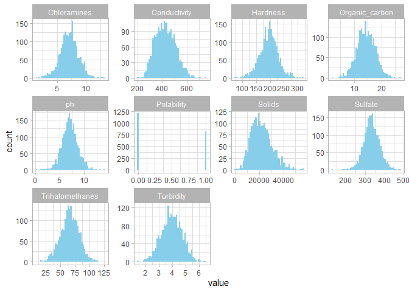
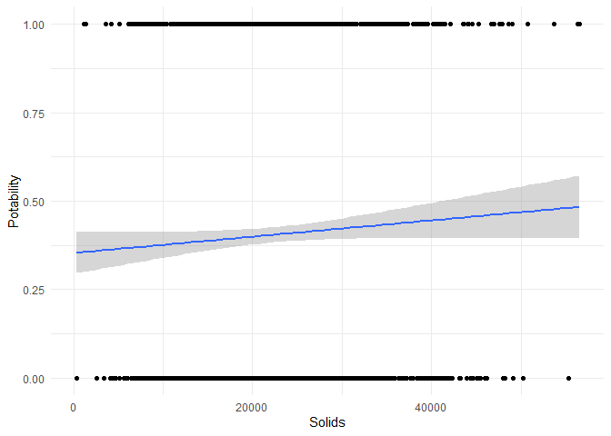
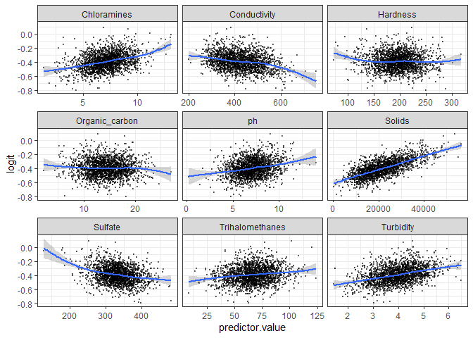
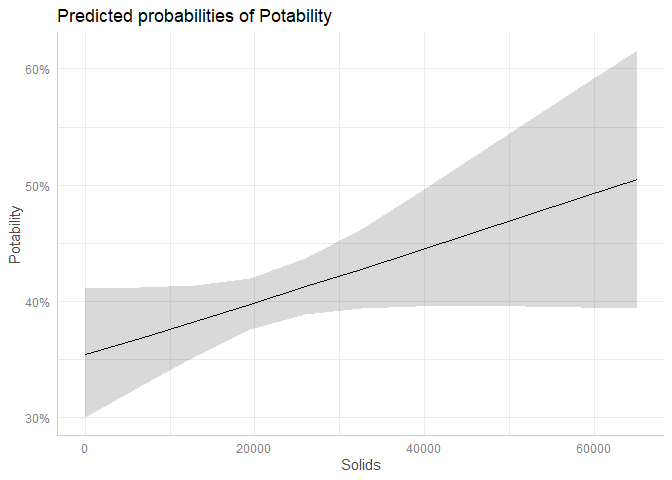
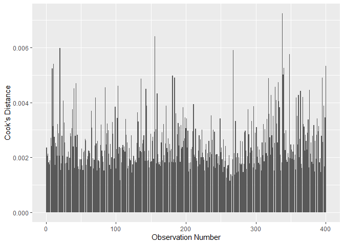

This notebook focuses on a dataset spanning over 3,000 observations of
water samples, collecting information such as hardness levels,
turbidity, potability, and more. For this study, we will be observing
how various water quality variables are related to water potability.

First, we load in the data and all necessary libraries.

``` r
setwd("C:/Users/withe/OneDrive/Desktop/DIDA 380D/data")
data_water <- read.csv("water_potability.csv")
library(dplyr)
```

    ## 
    ## Attaching package: 'dplyr'

    ## The following objects are masked from 'package:stats':
    ## 
    ##     filter, lag

    ## The following objects are masked from 'package:base':
    ## 
    ##     intersect, setdiff, setequal, union

``` r
library(ggplot2)
library(tidyr)
library(car)
```

    ## Loading required package: carData

    ## 
    ## Attaching package: 'car'

    ## The following object is masked from 'package:dplyr':
    ## 
    ##     recode

``` r
library(corrplot)
```

    ## corrplot 0.95 loaded

``` r
library(arm)
```

    ## Loading required package: MASS

    ## 
    ## Attaching package: 'MASS'

    ## The following object is masked from 'package:dplyr':
    ## 
    ##     select

    ## Loading required package: Matrix

    ## 
    ## Attaching package: 'Matrix'

    ## The following objects are masked from 'package:tidyr':
    ## 
    ##     expand, pack, unpack

    ## Loading required package: lme4

    ## 
    ## arm (Version 1.14-4, built: 2024-4-1)

    ## Working directory is C:/Users/withe/OneDrive/Desktop/DIDA 380D/data

    ## 
    ## Attaching package: 'arm'

    ## The following object is masked from 'package:corrplot':
    ## 
    ##     corrplot

    ## The following object is masked from 'package:car':
    ## 
    ##     logit

``` r
library(MASS)
library(cowplot)
library(lmtest)
```

    ## Loading required package: zoo

    ## 
    ## Attaching package: 'zoo'

    ## The following objects are masked from 'package:base':
    ## 
    ##     as.Date, as.Date.numeric

``` r
library(sandwich)
library(ResourceSelection)
```

    ## ResourceSelection 0.3-6   2023-06-27

``` r
library(broom)
library(rcompanion)
```

Next, we list out all the column names.

``` r
colnames(data_water)
```

    ##  [1] "ph"              "Hardness"        "Solids"          "Chloramines"    
    ##  [5] "Sulfate"         "Conductivity"    "Organic_carbon"  "Trihalomethanes"
    ##  [9] "Turbidity"       "Potability"

From there, we clean up all the NA values by deleting the corresponding
rows. This ends up removing around 1,000 observations, giving us 2,011
clean entries.

``` r
water_clean<-na.omit(data_water)
```

Then, we display the clean data set’s distribution of variables through
histograms.

``` r
ggplot(gather(water_clean), aes(value)) + 
    geom_histogram(bins = 50, fill = "skyblue") + 
    facet_wrap(~key, scales = 'free') +
    theme_light()
```

<!-- -->

Using a prop table, we observe that around 59% of the entries are
identified as non-potable, while 40% of them are potable.

``` r
prop.table(table(water_clean$Potability))
```

    ## 
    ##         0         1 
    ## 0.5967181 0.4032819

We first created a linear regression model, using Potability as the
dependent variable and all the other water quality indicators as the
explanatory variables. Some key observations to note:

- Solids are just barely significant, with a p-value of 0.067, and a
  coefficient of 0.00000237

- R-squared is 0.00343, Adjusted R-Squared is -0.000554

- F-statistic is 0.861 on 2002 DF.

``` r
# Disable scientific notation, ease of reading
options(scipen = 999, digits = 4)

# Linear regression model
model <- lm(formula = Potability ~ ph + Hardness + Solids + Chloramines + Sulfate + Conductivity + Trihalomethanes + Turbidity, data = water_clean)

summary(model)
```

    ## 
    ## Call:
    ## lm(formula = Potability ~ ph + Hardness + Solids + Chloramines + 
    ##     Sulfate + Conductivity + Trihalomethanes + Turbidity, data = water_clean)
    ## 
    ## Residuals:
    ##    Min     1Q Median     3Q    Max 
    ## -0.498 -0.406 -0.375  0.587  0.694 
    ## 
    ## Coefficients:
    ##                    Estimate  Std. Error t value Pr(>|t|)  
    ## (Intercept)      0.25892642  0.17423731    1.49    0.137  
    ## ph               0.00616692  0.00703163    0.88    0.381  
    ## Hardness        -0.00001141  0.00034057   -0.03    0.973  
    ## Solids           0.00000237  0.00000129    1.83    0.067 .
    ## Chloramines      0.00699686  0.00692596    1.01    0.313  
    ## Sulfate         -0.00010411  0.00027138   -0.38    0.701  
    ## Conductivity    -0.00009350  0.00013574   -0.69    0.491  
    ## Trihalomethanes  0.00029055  0.00068174    0.43    0.670  
    ## Turbidity        0.01418448  0.01405280    1.01    0.313  
    ## ---
    ## Signif. codes:  0 '***' 0.001 '**' 0.01 '*' 0.05 '.' 0.1 ' ' 1
    ## 
    ## Residual standard error: 0.491 on 2002 degrees of freedom
    ## Multiple R-squared:  0.00343,    Adjusted R-squared:  -0.000554 
    ## F-statistic: 0.861 on 8 and 2002 DF,  p-value: 0.549

Since we have non-constant variance and the model is heteroskedastic by
nature, we use robust standard error tests to correct the model.

``` r
coeftest(model, vcov. = vcovHC, type = "HC1")
```

    ## 
    ## t test of coefficients:
    ## 
    ##                    Estimate  Std. Error t value Pr(>|t|)  
    ## (Intercept)      0.25892642  0.17534621    1.48    0.140  
    ## ph               0.00616692  0.00691803    0.89    0.373  
    ## Hardness        -0.00001141  0.00035105   -0.03    0.974  
    ## Solids           0.00000237  0.00000128    1.85    0.065 .
    ## Chloramines      0.00699686  0.00710923    0.98    0.325  
    ## Sulfate         -0.00010411  0.00028217   -0.37    0.712  
    ## Conductivity    -0.00009350  0.00013663   -0.68    0.494  
    ## Trihalomethanes  0.00029055  0.00068529    0.42    0.672  
    ## Turbidity        0.01418448  0.01406163    1.01    0.313  
    ## ---
    ## Signif. codes:  0 '***' 0.001 '**' 0.01 '*' 0.05 '.' 0.1 ' ' 1

Then, we create another model that observes only the relationship
between water potability and solids, plotting it to observe its
relationship. Due to the binary nature of potability, we determined that
a linear regression doesn’t make sense for this dataset. The dependent
variable is linear, and the regression line doesn’t seem to be
constrained between 1 and 0.

``` r
model1 <- lm(formula = Potability ~ Solids, data = water_clean)

library(ggplot2)
ggplot(water_clean , aes(x = Solids, y = Potability))+
  geom_point()+
  geom_smooth(method = "lm", se = T)+
  theme_minimal()
```

    ## `geom_smooth()` using formula = 'y ~ x'

<!-- -->

Then, we create a logit model under model_logit, using the same
dependent and explanatory variables. In this summary, the coefficients
are interpreted as log-odds, with a 1 unit increase in x corresponding
with a y increase in log-odds for y. Some key observations to note:

- Again, Solids are the only statistically significant predictor here
  with a p-value of 0.067 and a coefficient of 0.00000984.

``` r
model_logit <- glm(as.integer(Potability) ~ ph + Hardness + Solids + Chloramines + Sulfate + Conductivity + Trihalomethanes + Turbidity, family = binomial(link = "logit"), data = water_clean)

summary(model_logit)
```

    ## 
    ## Call:
    ## glm(formula = as.integer(Potability) ~ ph + Hardness + Solids + 
    ##     Chloramines + Sulfate + Conductivity + Trihalomethanes + 
    ##     Turbidity, family = binomial(link = "logit"), data = water_clean)
    ## 
    ## Coefficients:
    ##                    Estimate  Std. Error z value Pr(>|z|)  
    ## (Intercept)     -0.99436649  0.72618754   -1.37    0.171  
    ## ph               0.02565788  0.02925222    0.88    0.380  
    ## Hardness        -0.00004712  0.00141663   -0.03    0.973  
    ## Solids           0.00000984  0.00000537    1.83    0.067 .
    ## Chloramines      0.02918447  0.02883326    1.01    0.311  
    ## Sulfate         -0.00043144  0.00112881   -0.38    0.702  
    ## Conductivity    -0.00039121  0.00056565   -0.69    0.489  
    ## Trihalomethanes  0.00120885  0.00283740    0.43    0.670  
    ## Turbidity        0.05923491  0.05849906    1.01    0.311  
    ## ---
    ## Signif. codes:  0 '***' 0.001 '**' 0.01 '*' 0.05 '.' 0.1 ' ' 1
    ## 
    ## (Dispersion parameter for binomial family taken to be 1)
    ## 
    ##     Null deviance: 2712.1  on 2010  degrees of freedom
    ## Residual deviance: 2705.2  on 2002  degrees of freedom
    ## AIC: 2723
    ## 
    ## Number of Fisher Scoring iterations: 4

To better interpret these results, we will exponentiate the log-odds to
create coefficients that are just percentages. Interestingly, for
Solids, we have:

|              |               |               |             |
|--------------|---------------|---------------|-------------|
| **Estimate** | **Std Error** | **Statistic** | **P Value** |
| 1.0000       | 0.000005368   | 1.83288       | 0.06682     |

At an odds ratio of 1, there is no effect on Potability when observing
Solids levels.

``` r
tidy(model_logit, exp=T)
```

    ## # A tibble: 9 × 5
    ##   term            estimate  std.error statistic p.value
    ##   <chr>              <dbl>      <dbl>     <dbl>   <dbl>
    ## 1 (Intercept)        0.370 0.726        -1.37    0.171 
    ## 2 ph                 1.03  0.0293        0.877   0.380 
    ## 3 Hardness           1.000 0.00142      -0.0333  0.973 
    ## 4 Solids             1.00  0.00000537    1.83    0.0668
    ## 5 Chloramines        1.03  0.0288        1.01    0.311 
    ## 6 Sulfate            1.000 0.00113      -0.382   0.702 
    ## 7 Conductivity       1.000 0.000566     -0.692   0.489 
    ## 8 Trihalomethanes    1.00  0.00284       0.426   0.670 
    ## 9 Turbidity          1.06  0.0585        1.01    0.311

Then, we’ll build some confidence intervals, both for log-odds and
exponentiated log-odds.

``` r
confint(model_logit)
```

    ## Waiting for profiling to be done...

    ##                         2.5 %     97.5 %
    ## (Intercept)     -2.4203728964 0.42771914
    ## ph              -0.0316648087 0.08306806
    ## Hardness        -0.0028252270 0.00273121
    ## Solids          -0.0000006843 0.00002037
    ## Chloramines     -0.0272936289 0.08579434
    ## Sulfate         -0.0026462728 0.00178106
    ## Conductivity    -0.0015019899 0.00071629
    ## Trihalomethanes -0.0043516929 0.00677637
    ## Turbidity       -0.0553558794 0.17406478

All predictors include 1, showing that there is no strong evidence that
any of these predictors change odds of potability.

``` r
exp(confint(model_logit))
```

    ## Waiting for profiling to be done...

    ##                   2.5 % 97.5 %
    ## (Intercept)     0.08889  1.534
    ## ph              0.96883  1.087
    ## Hardness        0.99718  1.003
    ## Solids          1.00000  1.000
    ## Chloramines     0.97308  1.090
    ## Sulfate         0.99736  1.002
    ## Conductivity    0.99850  1.001
    ## Trihalomethanes 0.99566  1.007
    ## Turbidity       0.94615  1.190

We’ll check for linearity in this model to ensure that our model
assumptions are valid. For the most part, all predictors seem linear,
with some slight curving for Conductivity and Sulfate, which seem to be
the result of some outlier values. Thus, no transformations are
necessary.

``` r
# Check the linearity assumption
df_model <- water_clean %>% dplyr::select(-Potability)
predictors <- colnames(df_model)
df_model$probabilities <- model_logit$fitted.values

# Clean up data and calculate log odds for plot against each predictor
df_model <- df_model %>%
  mutate(logit = log(probabilities/(1-probabilities))) %>%
  dplyr::select(-probabilities) %>% 
  gather(key = "predictors", value = "predictor.value", -logit) 

# Plot construction
ggplot(df_model, aes(y = logit, x = predictor.value))+
  geom_point(size = 0.5, alpha = 0.5) +
  geom_smooth(method = "loess") + 
  theme_bw() + 
  facet_wrap(~predictors, scales = "free_x")
```

    ## `geom_smooth()` using formula = 'y ~ x'

<!-- -->

Then, we’ll run stepwise selection in both directions to determine which
predictors to keep that will lower AIC. The results show that only
Solids seem to decrease AIC (from -2863 to -2864), while all other
predictors increase it.

``` r
# Intercept-only model
intercept_model <- lm(Potability ~ 1, data = water_clean)

# Full model with all predictors
full_model <- glm(as.integer(Potability) ~ ph + Hardness + Solids +
  Chloramines + Sulfate + Conductivity + Trihalomethanes + Turbidity,
  family = binomial(link = "logit"), data = water_clean)
```

``` r
# Run stepwise-selection in both directions
both <- step(intercept_model, direction = 'both', scope = formula(full_model), trace=1)
```

    ## Start:  AIC=-2863
    ## Potability ~ 1
    ## 
    ##                   Df Sum of Sq RSS   AIC
    ## + Solids           1     0.801 483 -2864
    ## <none>                         484 -2863
    ## + Turbidity        1     0.249 484 -2862
    ## + Chloramines      1     0.209 484 -2861
    ## + Conductivity     1     0.116 484 -2861
    ## + Sulfate          1     0.113 484 -2861
    ## + ph               1     0.102 484 -2861
    ## + Trihalomethanes  1     0.041 484 -2861
    ## + Hardness         1     0.001 484 -2861
    ## 
    ## Step:  AIC=-2864
    ## Potability ~ Solids
    ## 
    ##                   Df Sum of Sq RSS   AIC
    ## <none>                         483 -2864
    ## + Chloramines      1     0.254 483 -2863
    ## + Turbidity        1     0.232 483 -2863
    ## - Solids           1     0.801 484 -2863
    ## + ph               1     0.160 483 -2863
    ## + Conductivity     1     0.113 483 -2862
    ## + Trihalomethanes  1     0.047 483 -2862
    ## + Sulfate          1     0.037 483 -2862
    ## + Hardness         1     0.000 483 -2862

``` r
# Print out anova to compare results
both$anova
```

    ##       Step Df Deviance Resid. Df Resid. Dev   AIC
    ## 1          NA       NA      2010      483.9 -2863
    ## 2 + Solids -1   0.8006      2009      483.1 -2864

We can now move on with confidence to create our second model, which now
only includes Solids as the sole predictor of Potability. However, the
coefficient and p-value don’t seem to change meaningfully from the
original model.

``` r
model_logit2 <- glm(as.integer(Potability) ~ Solids, family = binomial(link = "logit"), data = water_clean)

summary(model_logit2)
```

    ## 
    ## Call:
    ## glm(formula = as.integer(Potability) ~ Solids, family = binomial(link = "logit"), 
    ##     data = water_clean)
    ## 
    ## Coefficients:
    ##                Estimate  Std. Error z value  Pr(>|z|)    
    ## (Intercept) -0.60216242  0.12438535   -4.84 0.0000013 ***
    ## Solids       0.00000957  0.00000525    1.82     0.068 .  
    ## ---
    ## Signif. codes:  0 '***' 0.001 '**' 0.01 '*' 0.05 '.' 0.1 ' ' 1
    ## 
    ## (Dispersion parameter for binomial family taken to be 1)
    ## 
    ##     Null deviance: 2712.1  on 2010  degrees of freedom
    ## Residual deviance: 2708.8  on 2009  degrees of freedom
    ## AIC: 2713
    ## 
    ## Number of Fisher Scoring iterations: 4

Exponentiating the log-odds shows that Solids still do not have a very
large impact on Potability.

``` r
tidy(model_logit2, exp=T)
```

    ## # A tibble: 2 × 5
    ##   term        estimate  std.error statistic    p.value
    ##   <chr>          <dbl>      <dbl>     <dbl>      <dbl>
    ## 1 (Intercept)    0.548 0.124          -4.84 0.00000129
    ## 2 Solids         1.00  0.00000525      1.82 0.0684

Now, we’re going to try to predict probabilities with this model. First,
we generate a synthetic dataset called newdata1 that takes the mean of
Solids. This shows that a water sample with average Solids level will
have around a 40% chance of being potable.

``` r
newdata1 <- with(water_clean, data.frame(Solids = mean(Solids)))


newdata1$Potability_p <- predict(model_logit2, newdata = newdata1, type = "response")

newdata1
```

    ##   Solids Potability_p
    ## 1  21917       0.4031

After plotting predicted probabilities, the linearity assumption does
not seem to be violated.

``` r
# Plot predicted probabilities 
library(ggeffects)
```

    ## 
    ## Attaching package: 'ggeffects'

    ## The following object is masked from 'package:cowplot':
    ## 
    ##     get_title

``` r
Solids_atmeans <- ggpredict(model_logit2, terms = "Solids[0:65000 by = 6500]")
plot(Solids_atmeans)
```

<!-- -->

4/N is 4/400, or 0.01. Since the highest that this model reaches is
around 0.006, which is below 0.01, no observation is extremely
influential in this model. There are some high spikes, which are good to
note but not extreme enough to remove from the model.

``` r
#create a dataframe of Cook's Distance calculations
cooks <- cooks.distance(model_logit2)
id <- c(1:400)

cooks_data <- cbind(id, cooks)
```

    ## Warning in cbind(id, cooks): number of rows of result is not a multiple of
    ## vector length (arg 1)

``` r
#plot it
ggplot(cooks_data, aes(x = id, y = cooks))+
  geom_bar(stat = "identity")+
  labs(x = "Observation Number", y = "Cook's Distance")
```

<!-- -->

Because there are no other predictors besides Solids, the model can’t
suffer from multicollinearity, thus running vif() will produce an error.

``` r
# vif(model_logit2)
```

Here, we calculate the pseudo R-squared, which show that in all three
variations, the value is close to 0. This indicates that the full model
is not much better than the null model, meaning the model does not
explain much variation.

Additionally, the function also runs a likelihood ratio test. Again, it
shows that the predictor, Solids, barely explains any variation at a
p-value of ~0.068

``` r
nagelkerke(model_logit2)
```

    ## $Models
    ##                                                                                       
    ## Model: "glm, as.integer(Potability) ~ Solids, binomial(link = \"logit\"), water_clean"
    ## Null:  "glm, as.integer(Potability) ~ 1, binomial(link = \"logit\"), water_clean"     
    ## 
    ## $Pseudo.R.squared.for.model.vs.null
    ##                              Pseudo.R.squared
    ## McFadden                             0.001224
    ## Cox and Snell (ML)                   0.001649
    ## Nagelkerke (Cragg and Uhler)         0.002228
    ## 
    ## $Likelihood.ratio.test
    ##  Df.diff LogLik.diff Chisq p.value
    ##       -1       -1.66  3.32 0.06846
    ## 
    ## $Number.of.observations
    ##            
    ## Model: 2011
    ## Null:  2011
    ## 
    ## $Messages
    ## [1] "Note: For models fit with REML, these statistics are based on refitting with ML"
    ## 
    ## $Warnings
    ## [1] "None"

Comparing the two logit models, the p-value is very high at 0.83,
showing that the additional predictors does not improve model fit at all
compared to having just Solids.

``` r
lrtest(model_logit, model_logit2)
```

    ## Likelihood ratio test
    ## 
    ## Model 1: as.integer(Potability) ~ ph + Hardness + Solids + Chloramines + 
    ##     Sulfate + Conductivity + Trihalomethanes + Turbidity
    ## Model 2: as.integer(Potability) ~ Solids
    ##   #Df LogLik Df Chisq Pr(>Chisq)
    ## 1   9  -1353                    
    ## 2   2  -1354 -7  3.58       0.83

After running the Hosmer-Lemeshow Test, we can see that the p-value of
0.4 is greater than 0.05, showing that the model fails to reject the
null hypothesis. This means that the logistic regression model is an
acceptable fit for our data.

``` r
hoslem.test(water_clean$Potability, fitted(model_logit2), g = 10)
```

    ## 
    ##  Hosmer and Lemeshow goodness of fit (GOF) test
    ## 
    ## data:  water_clean$Potability, fitted(model_logit2)
    ## X-squared = 8.2, df = 8, p-value = 0.4

Here we check if the probit model is any better than our logit results.
It is not!

``` r
model_probit <- glm(Potability ~ ph + Hardness + Solids + Chloramines + Sulfate + Conductivity + Trihalomethanes + Turbidity, family = binomial(link = "probit"), data = water_clean)

summary(model_probit)
```

    ## 
    ## Call:
    ## glm(formula = Potability ~ ph + Hardness + Solids + Chloramines + 
    ##     Sulfate + Conductivity + Trihalomethanes + Turbidity, family = binomial(link = "probit"), 
    ##     data = water_clean)
    ## 
    ## Coefficients:
    ##                    Estimate  Std. Error z value Pr(>|z|)  
    ## (Intercept)     -0.62758476  0.45071381   -1.39    0.164  
    ## ph               0.01523090  0.01816952    0.84    0.402  
    ## Hardness        -0.00000700  0.00087997   -0.01    0.994  
    ## Solids           0.00000610  0.00000334    1.83    0.067 .
    ## Chloramines      0.01785746  0.01790411    1.00    0.319  
    ## Sulfate         -0.00023076  0.00070118   -0.33    0.742  
    ## Conductivity    -0.00024219  0.00035110   -0.69    0.490  
    ## Trihalomethanes  0.00074098  0.00176206    0.42    0.674  
    ## Turbidity        0.03664473  0.03632615    1.01    0.313  
    ## ---
    ## Signif. codes:  0 '***' 0.001 '**' 0.01 '*' 0.05 '.' 0.1 ' ' 1
    ## 
    ## (Dispersion parameter for binomial family taken to be 1)
    ## 
    ##     Null deviance: 2712.1  on 2010  degrees of freedom
    ## Residual deviance: 2705.3  on 2002  degrees of freedom
    ## AIC: 2723
    ## 
    ## Number of Fisher Scoring iterations: 4
